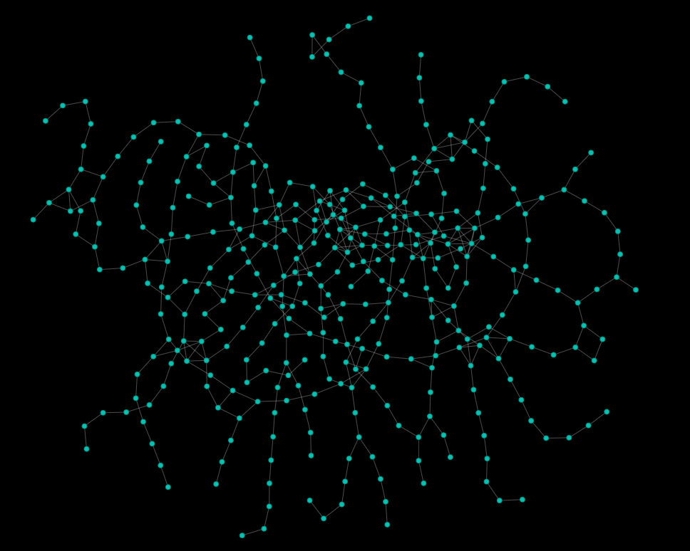

# metro_parisien

Le projet consiste à trouver le plus court chemin entre 2 stations de métro.
Pour lancer le programme, vous avez besoin des outils suivants :
- python 3.8 ou ultérieurement
- pyvis (pour la partie graphique qui va être implementée dans le futur)

Pour installer pyvis, il faut que vous ayez l'outil de la gestion des packages python *pip*.
- https://pip.pypa.io/en/stable/installation/
- https://pyvis.readthedocs.io/en/latest/install.html

Nous avons à disposition le fichier suivant : 
- metro.txt

Nous avons décidé de séparer notre projet en 2 parties : les structures de données et les fonctions.

La première partie est écrite en orienté objet et la deuxième partie est fonctionnelle.
Python utilise la programmation orientée objet et la programmation fonctionnelle, ce découpage exploite la diversité du langage Python.

Dans la documentation nous allons voir d'abord les structures de données que nous avons choisi. Elles ont était implémenté en classe.Puis,les fonctions que nous avons programmé grâce à nos structure de données. Pour finir, nous allons voir les améliorations que nous pouvons apporter en plus sur le projet.


# Sommaire

- [Structure des données](#structure-de-données)
    - [Graph](#graph)<br>
    - [Node](#node)<br>
    - [Edge](#edge)<br>
    - [Line](#line)<br>
<br>

- [Fonctions principales](#fonctions-principales)
    - [Initialiser le graphe](#initialiser-le-graphe)<br>
    - [Vérifier la connexité](#vérifier-la-connexité)<br>
    - [Trouver les lignes avec les stations de métro associées](#trouver-les-lignes-avec-les-stations-de-métro-associées)<br>
    - [Trouver les terminus des lignes](#trouver-les-terminus-des-lignes)<br>
    - [Trouver le plus court chemin](#trouver-le-plus-court-chemin)<br>

<br>

- [Améliorations possibles](#améliorations-possibles)
    - [Stockage dans une base de données](#stockage-dans-une-base-de-données)<br>
    - [Compléter les stations manquantes du métro parisien](#compléter-les-stations-manquantes-du-métro-parisien)<br>
    - [Affichage graphique des sommets avec la librairie externe pyvis](#affichage-graphique-des-sommets-avec-la-librairie-externe-pyvis)
    
<br>


---
## Structure de données
Notre structure de données est constitué de 4 classes : graph, node, line, edge.
Graph va nous servir à créer notre carte de métro parisien. 
Node va nous permettre de répresenter les stations de métro.
Line va nous permettre de répresenter les lignes de métro. 
Edge va nous permettre de créer les liaisons direct entre deux stations de métro. 

### Graph

Un graphe quelques soit sa manière de représentations ou son type (orienté ou non) possède des noeuds et des arêtes. 

Cette classe permet d'initialiser un graphe vide.

L'attribut "number_of_node" est le nombre de noeuds du graphe. 

Les noeuds sont ajouté au graphe grâce à la méthode add_node() et sont créer par la classe Node.

Les noeuds sont stockés dans l'attribut node_list. Cet attribut est un dictionnaire. La clé du dictionnaire est l'identifiant unique des noeuds et la valeur est l'adresse du noeud.

La méthode get_nodes() nous permet d'obtenir tous les noeuds. Les noeuds sont renvoyés par leurs identifiants.

La méthode get_node(id_noeud) nous permet d'obtenir l'adresse du noeud et ainsi pouvoir utiliser l'instance noeud. 

On peut aussi supprimer des noeuds du graphe grace à la méthode remove_node().

La liaison entre deux noeuds est assuré par la méthode add_edge().
Elle crée une instance de la classe Edge. 
Cela représente ainsi une "arête" entre les noeuds.

#### Attributs

+ number_of_node: int
+ node_list: Mapping[int, Node]

#### Méthode

+ get_number_of_node(): int
+ set_number_of_node(number_of_node)
+ get_nodes: List[int]
+ get_node: Optional[Node]
+ add_node(number_of_node: int, node: Node)
+ remove_node(number_of_node: int): Node

+ add_edge(node1: int, node2: int, weight: int): Edge

+ __contains__(number_of_node: int)
+ __iter__()


### Node

La classe Node permet de créer des noeuds/sommets. 
Un noeud, pour notre projet, est une station de métro. 

Chaque noeud possède un identifiant unique. Cette identifant est stockés dans l'attribut id. 

Un chemin est une suite de noeuds qui permet d'aller d'un noeud x à un noeud y.
L'attribut predecessor est un noeud x qui précède dans un chemin le noeud créé. Il est initialisé à "None" puisque le noeud créer n'est pas encore lié à des autres. Il peut être ainsi modifié par la suite.

Dans un chemin pour passer d'un noeud à un autre, il faut que ses noeuds soivent connecté. 
Chaque noeud x, connecté au noeud crée, est stockée dans l'attribut connectTo. connectedTo est un dictionnaire. La clé est l'identifiant d'un noeud x et la valeur est l'adresse en mémoire de ce noeud. 
Pour avoir accès à la liste de tous les noeuds connectés au noeud crée, il y a la méthode get_connections(). Permettant ainsi de savoir quel noeud est connecté avec quel autre noeud.
Les méthodes add_connection permet d'ajouter un noeud x à connectedTo.  
La méthode remove_connection permet de supprimer un noeud x à connectedTo.

Pour finir, chaque noeud est affilé à une ligne de métro.
 
#### Attributs

+ id: int
+ name: str
+ color: str
+ predecessor: Optional[Node]
+ line : str
+ connectedTo: Mapping[int, Node]


#### Méthode

+ get_id(): int
+ set_id(id: int)

+ get_name(): str
+ set_name(name: str)

+ get_color(): str
+ set_color(color: str)

+ get_predecessor(): Optional[Node]
+ set_predecessor(predecessor: str)

+ get_line(): Optional[str]
+ set_line(line: str)

+ get_connections(): List[int]
+ add_connection(number_of_node: int, connection: Node)
+ remove_connection(number_of_node: int)

+ __str__()
+ __iter__()
+ __contains__(number_of_node: int)


### Edge

La classe Edge représente une arête entre deux noeuds.
Pour comprendre plus facilement le fonctionnement de cette classe  par rapport à notre projet, nous allons utiliser station de métro pour parler de noeud.

La liaison entre deux stations de métro se fait uniquement si elle est directe et si elle ne passe pas par d'autre stations. 
Ainsi une liaison (une instance de la classe Edge) se fait entre deux stations. 
La station de départ est stocké dans l'attribut starting_node et la station d'arriver dans arrival_node. 
La distance en seconde entre ses deux stations est stockée dans l'attribut weight.

La direction de la liaison est en rapport avec la classe Line et ainsi par rapport au ligne de métro. 
Une ligne de métro possède des terminus. Lorsqu'on veut passer d'une station de métro x à une station de métro y, nous prenons une ligne de métro qui va vers un terminus. 
La direction d'une liaison est donc ce concept. 
Une liaison va vers un terminus d'une ligne. Ainsi la direction est un terminus (station de métro)
Cette direction est stocké dans l'attribut direction. 
Il y a des méthodes qui permettent d'ajouter ou supprimer cette direction. 

Pour créer une liaison entre deux stations de métro nous avons la méthode get_connections_of_node() qui à partir d'un sommet trouver toutes les liaisons de ce sommet.


#### Attributs
+ cls.edge_list: List = []

+ starting_node: Node
+ arrival_node: Node
+ weight: int
+ direction: Optional[List[str]]

#### Méthode

+ get_starting_node(): Node
+ set_starting_node(node: Node)

+ get_arrival_node(): Node
+ set_arrival_node(node: Node)

+ get_weight(): int
+ set_weight(weight: int)

+ get_direction(): str
+ add_direction(direction: str)
+ remove_direction(direction: str)

+ get_connections_of_node(cls, node: Node): List[Tuple[Node, int, Optional[str]]]
+ get_weight_of_nodes(cls, starting_node: Node, arrival_node: Node): Optinal[int]
+ get_direction_of_nodes(cls, starting_node: Node, arrival_node: Node): Optional[str]

+ get_number_of_edge(cls): int
+ get_edge_list(cls): List[Edge]

+ __iter__()
+ __str__()


### Line

La classe Line répresente une ligne de métro. 

Une ligne de métro possède un numéro, des stations et des terminus. 
Le numéro de la ligne est stocké dans l'attribut numero.
Les stations desservies par la ligne sont stockée dans l'attribut node_list. node_list est un dictionnaire. La clé est l'identifiant unique des stations et la valeur est l'adresse de la station. 
Les terminus sont stockés dans l'attribut terminus. C'est un dictionnaire de même type que node_list. Le dictionnaire possède les terminus des deux sens de la ligne de métro. 
Les stations desservies sont ajoutées par la fonction add_node() ou supprimer par remove_node(). 
De même que les terminus sont ajoutés par la fonction add_terminus() et supprimer par remove_terminus()

#### Attributs 

+ cls.line_list: List
+ numero: str
+ color: str
+ node_list: Mapping[int: Node]
+ number_of_node: int
+ terminus: Mapping[int: Node]
---
#### Méthodes

+ get_numero(): int:
+ set_numero(numero: str)

+ get_color(): str:
+ set_color(color: str)

+ get_nodes(): List[int]
+ get_node(number_of_node: int): Optional[Node]
+ add_node(number_of_node: int, node: Node)
+ remove_node(number_of_node: int): Node

+ get_number_of_node(): int:
+ set_number_of_node(number_of_node: int)

+ get_terminus_nodes(): List[Node]
+ get_terminus_number(): List[int]
+ get_terminus(): Iterator

+ add_terminus(number_of_node: int, node: Node)
+ remove_terminus(number_of_node: int)

+ cls.get_line_list(): Mapping[str: Line]

+ \_\_iter__()
+ \_\_contains__(number_of_node)

---

## Fonctions principales

### Initialiser le graphe
Pour initialiser le graphe, nous avons fait une fonction pour extraire les données dans metro.txt et les stocker dans notre graphe.

La fonction regarde le premier caractère de chaque ligne afin de déterminer le traitement associé. Il y a 3 cas possibles :

- si la ligne commence par #, on la néglige.
- si la ligne commence par V, on ajoute au graphe un noeud
- si la ligne commence par E, on ajoute au graphe une arête dans un sens et dans l'autre sens pour rendre le graphe non orienté afin de faciliter l'implémentation des algorithmes.

### Vérifier la connexité
Pour vérifier la connexité du graphe, nous avons fait un parcours en largeur. (fonction bfs)

Dans un premier temps, tous les sommets sont mis en blanc.
Un sommet est selectionner et ajouter à une liste. Cette liste répresente les sommets à traiter. Tant que la liste à traiter n'est pas vide, le premier élément de la liste est sélectionner. Tous les successeurs du sommet sont ajouter à la liste à traiter. Lorsque tous les sucesseurs sont traiter, le sommet père est mis en noir et est enlever de la liste à traiter. Et cela s'itere jusqu'à que tous les sommets liée soit traiter. 

Dans un second temps, on applique la fonction au sommet du graphe. Si un sommet n'est pas colorié en noir alors le graphe n'est pas connexe


### Trouver les lignes avec les stations de métro associées
Pour trouver les stations d'une ligne de métro, nous avons décidé de faire un parcours en profondeur. (fonction pp)

On initialise une liste. On choisit une station de départ qu'on rajoute à liste. On itère sur les sucesseur de cette station. Si un sucesseur n'a pas le même nom que la station choisi, nous ajoutons ce sucesseur dans la liste. Si le même nom on le néglige. L'itération quand tous les stations sont dans la liste.

### Trouver les terminus des lignes
Pour trouver les terminus des lignes, nous avons utilisé la fonctions pp. Lorsque une station a un unique  successeur qui a un nom différent alors c'est un terminus de la ligne. 

Nous avons vérifier les lignes et les terminus humainement. Les numéros des lignes ont été ajouté à la main. 

### Trouver le plus court chemin
Pour trouver le plus court chemin, nous avons utilisé l'algorithme de Dijkstra.
Nous l'avons simplement implimenter en utilisé les strutures de donnée crée.

---

## Améliorations possibles
### Stockage dans une base de données
La structure des données de notre programme permet de stocker de manière intuitive les informations dans une base de données grâce à une technique appelée ORM.
### Compléter les stations manquantes du métro parisien
Il y a des informations manquantes dans le projet. Comme la date de création du métro.txt date, il y a des stations de métro qui ont apparu entre temps.
Le code ci-dessous représente les stations des métros manquantes.

```json
{
    "12": {
        "stations": [
            "Front Populaire"
        ]
    },
    "13": {
        "stations": [
            "Les Agnettes"
        ]
    },
    "14": {
        "stations": [
            "Mairie de Saint-Ouen",
            "Saint-Ouen",
            "Porte de Clichy",
            "Pont Cardinet",
            "Saint-Lazare",
            "Olympiades"
        ]
    },
    "4": {
        "stations": [
            "Mairie de Montrouge",
            "Barbara",
            "Bagneux - Lucie Aubrac"
        ]
    },
    "8": {
        "name": "M\u00e9tro 8",
        "stations": [
            "Creteil-Pointe du Lac"
        ]
    }
}
```

### Affichage graphique des sommets avec la librairie externe *pyvis*
L'example qui n'est pas fini donc nous avons décidé de ne pas mettre tous de suite le code sur github.

L'image du plan des lignes de métro.


L'image sur une zone du métro.
